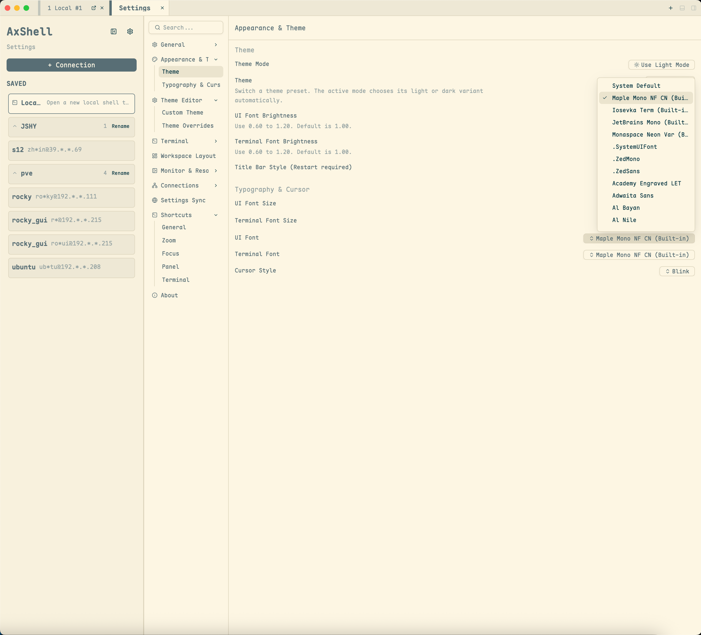

[简体中文](bundled-fonts.zh.md) · [Documentation](../README.md)

# Bundled Fonts

AxShell embeds a small set of terminal-friendly fonts so the application has useful defaults before users configure system fonts. The runtime font files and local license notices live in [assets/fonts](../../assets/fonts/README.md).

## Font Families

| Family | Source repository | Bundled version | Bundled styles | Intended use |
| --- | --- | --- | --- | --- |
| Maple Mono NF CN | [subframe7536/maple-font](https://github.com/subframe7536/maple-font) | bundled release | Regular, Bold | Default terminal font with CJK and Nerd Font coverage |
| Iosevka Term | [be5invis/Iosevka](https://github.com/be5invis/Iosevka) | 8.0.0 | Regular, Bold, Italic, Bold Italic | Compact terminal text and dense English code |
| JetBrains Mono | [JetBrains/JetBrainsMono](https://github.com/JetBrains/JetBrainsMono) | 2.304 | Regular, Bold, Italic, Bold Italic | General-purpose programming and terminal text |
| Monaspace Neon Var | [githubnext/monaspace](https://github.com/githubnext/monaspace) | 1.400 | Variable font | Variable 200-800 weight, 100-125 width, and slant support |

Only the styles selected by AxShell's renderer are bundled. Iosevka Extended, Oblique and extra weights; JetBrains Mono NL, web and extra weights; and Monaspace Argon, Krypton, Radon and Xenon are intentionally excluded.

## Licensing

The bundled font files are distributed under the SIL Open Font License 1.1. Local notices are kept with the font files:

- [Maple Mono license](../../assets/fonts/LICENSE.txt)
- [Iosevka license](../../assets/fonts/LICENSE-Iosevka.txt)
- [JetBrains Mono license](../../assets/fonts/LICENSE-JetBrainsMono.txt)
- [Monaspace license](../../assets/fonts/LICENSE-Monaspace.txt)

When changing bundled fonts, update this page, [assets/fonts/README.md](../../assets/fonts/README.md), `src/app/theme.rs`, and the Settings font ordering together.
