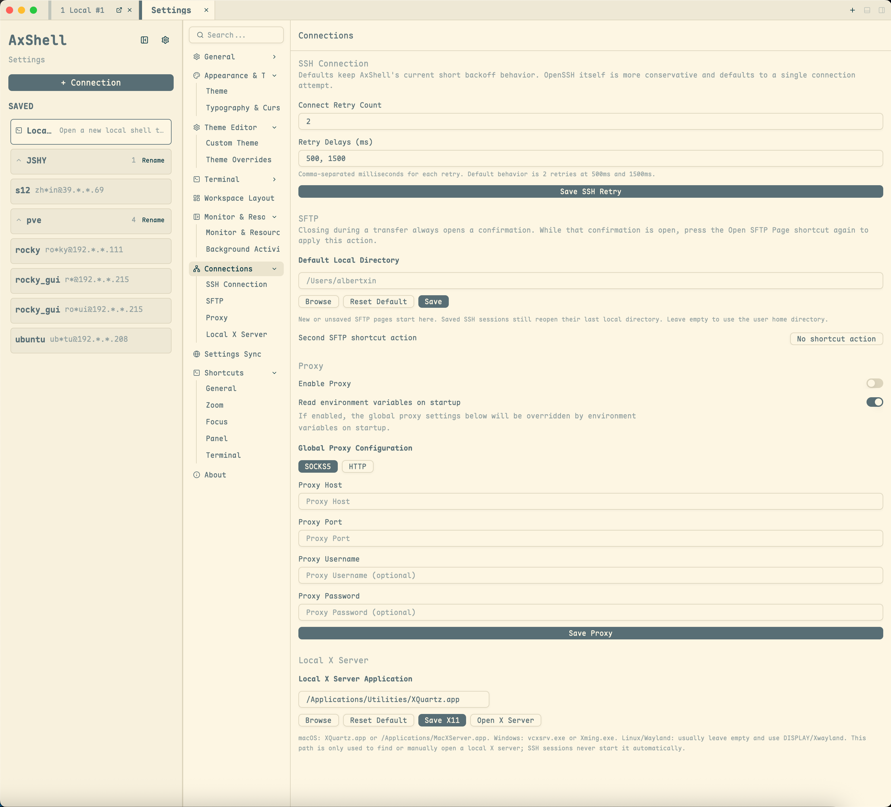

[English](proxy-x11.md) · [文档导航](../README.zh.md)

# 代理与 X11

## 代理优先级

SSH 和 SFTP 连接可以使用：

- 单会话代理；
- 启动时读取的代理环境变量；或
- 已配置的全局代理。

代理类型支持 `socks5` 和 `http`，可以填写用户名和密码。环境变量读取会检查 `ALL_PROXY`、`HTTPS_PROXY`、`HTTP_PROXY` 及其小写形式。

## X11 转发

X11 转发可以让远端 SSH 主机启动的兼容图形程序通过本地 X server 显示。

各平台要求：

- macOS：XQuartz
- Windows：VcXsrv 或 Xming
- Linux/Wayland：本地 `DISPLAY` 或 Xwayland

## 本地 X Server 下载地址

AxShell 不内置也不会自动启动本地 X server。使用 SSH X11 转发前，需要先安装并启动一个本地 X server。新建或编辑 SSH 时，每个会话默认勾选 X11 转发；未检测到本机 X server 时会显示简短安装提示。

| 平台 | X server | 获取地址 | 说明 |
| --- | --- | --- | --- |
| macOS | XQuartz | [xquartz.org](https://www.xquartz.org/) | macOS 上的稳定默认选择，通常安装为 `/Applications/Utilities/XQuartz.app`。 |
| macOS | MacXServer | [macxserver.com/download](https://macxserver.com/download/) 或 [GitHub releases](https://github.com/toddvernon/MacXServer/releases) | 较新的 macOS rootless X server。AxShell 会把 `MacXServer.app` 视为 display `127.0.0.1:0`，对应端口 `6000` / display `:0`。 |
| Windows | VcXsrv | [GitHub releases](https://github.com/marchaesen/vcxsrv/releases) 或 [SourceForge](https://sourceforge.net/projects/vcxsrv/) | 当前更常用的开源 Windows 选项。AxShell 会识别常见的 `VcXsrv` 安装路径。 |
| Windows | Xming | [SourceForge archive](https://sourceforge.net/projects/xming/) 或 [Straight Running](https://www.straightrunning.com/XmingNotes/) | Windows 上的旧牌替代方案；较新的下载可能需要按 Straight Running 的授权/下载流程获取。 |
| Linux / Wayland | X.Org / Xwayland | 通过发行版包管理器安装；项目背景可见 [X.Org](https://xorg.freedesktop.org/wiki/) 和 [Wayland](https://wayland.freedesktop.org/)。 | 优先安装发行版提供的 `xwayland` 或 X.Org server 包，不建议随意下载独立二进制。 |

连接前需要确认本地 X server 已运行、该 SSH 会话已勾选“启用 X11 转发”、远端 `sshd` 允许 `X11Forwarding yes`，并且远端程序支持 X11。

Windows 会分别识别 `vcxsrv.exe` 和 `Xming.exe`。两者均使用兼容的 XWin 启动参数，从 display `:0` 开始；对应端口被占用时继续尝试后续 display。自定义 X server EXE 不会被推断参数。

## 故障排查

- 先确认代理主机和端口在 AxShell 之外可以访问。
- 检查单会话代理是否覆盖了全局设置。
- 排查远端程序前，先确认 `DISPLAY` 和本地 X server。AxShell 在 X11 request 被服务器接受后交由 `sshd` 分配远端 display，不会强制写死远端 `DISPLAY`。
- 如果远端程序报 `unable to open X server ''`，表示它拿到的 `DISPLAY` 是空的。确认 SSH 新建/编辑窗口中该会话已勾选“启用 X11 转发”，修改后重新连接；确认服务器 `sshd` 配置了 `X11Forwarding yes`，再在远端 shell 中执行 `echo $DISPLAY`。如果 `echo $DISPLAY` 非空但通过 `sudo` 运行失败，请按服务器策略保留 `DISPLAY` / `XAUTHORITY`，或以登录用户执行图形命令。
- 从运行日志中查找代理协商或 X11 relay 错误。

### Windows 缺少 Visual C++ 运行库

如果 Windows zip 版本无法启动，并提示缺少运行库 DLL，例如：

```text
VCRUNTIME140.dll was not found
MSVCP140.dll was not found
VCRUNTIME140_1.dll was not found
```

先安装或修复 Microsoft Visual C++ Redistributable 运行库。使用 `windows-x86_64` 版本时，安装微软最新支持的 x64 Visual C++ Redistributable：

<https://learn.microsoft.com/en-us/cpp/windows/latest-supported-vc-redist>

也可以使用 `abbodi1406/vcredist` 这个一体化修复工具，它会打包当前 Microsoft Visual C++ Redistributable 运行库：

<https://github.com/abbodi1406/vcredist>

从项目 release 下载后，以管理员身份运行；可以使用默认安装方式，也可以用静默/自动模式：

```powershell
.\VisualCppRedist_AIO_x86_x64.exe /y
```

运行库安装或修复完成后，重新启动 AxShell。

### Ubuntu 缺少运行库

如果 Linux tarball 无法启动，并且 `ldd ./ax_shell` 显示：

```text
libxkbcommon-x11.so.0 => not found
```

在 Ubuntu 上安装对应运行库：

```bash
sudo apt update
sudo apt install -y libxkbcommon-x11-0
```

然后重新检查二进制：

```bash
ldd ./ax_shell | grep "not found"
```

没有输出表示动态链接器已经找到所需运行库。如果仍有其他库显示为 `not found`，先安装对应的 Ubuntu runtime package，再启动 AxShell。
