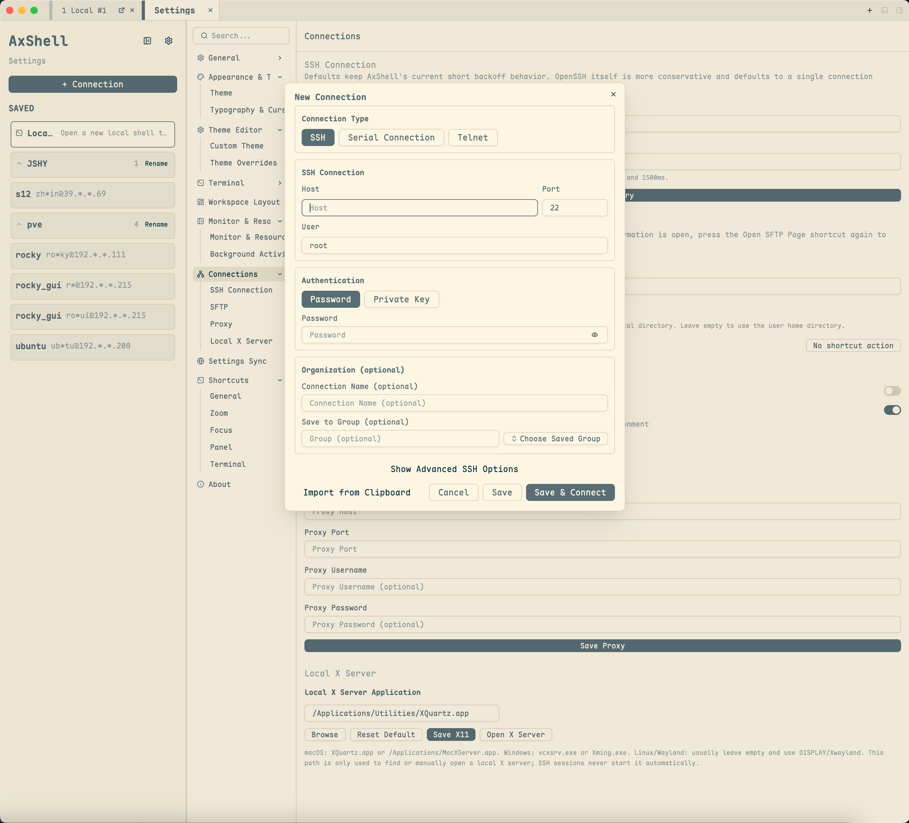

[English](serial-telnet.md) · [文档导航](../README.zh.md)

# 串口与 Telnet

AxShell 可以将串口控制台和 Telnet 会话与本地终端、SSH 连接一起保存和重新打开。它们共用终端标签、Pane、搜索和快捷键控制。

## 新建连接

1. 打开**新建连接**或会话选择器。
2. 在**连接类型**中选择**串口**或 **Telnet**。
3. 按需设置连接名称和分组。
4. 检查对应连接类型的字段后，选择**保存**或**保存并连接**。

保存后的条目会与其他已保存会话一同显示。会话选择器会展示串口和波特率，或 Telnet 主机和端口。

## 串口控制台

表单打开或切换到**串口**时，AxShell 会检测本机可用的串口。设备刚接入时可使用**刷新**，随后选择检测到的端口或手动填写端口。

按设备要求配置波特率、数据位、校验、停止位和流控。默认值为 `115200 8N1`、无流控。断开连接或关闭终端会释放串口；解决线缆、设备或端口占用问题后，可使用常规重连操作。

## Telnet

填写 Telnet 主机和端口，默认端口为 `23`。AxShell 会执行保守的 Telnet 协商，使远端能够接收终端尺寸更新，并保持交互式终端输入可用。

Telnet 不提供加密。仅应在可信网络和明确要求 Telnet 的系统中使用；服务器支持 SSH 时应优先使用 SSH。

## 仅 SSH 支持的能力

SFTP 页面、远程系统监控、X11 转发、SSH 私钥/密码认证和 SSH 连接健康恢复仅适用于 SSH 会话。串口或 Telnet 会话仅提供终端连接，不会打开 SFTP 页面。

本地 Shell 和 SSH 设置见[终端与 SSH](terminal-ssh.zh.md)；标签、Pane 与独立终端窗口见[工作区](workspace.zh.md)。
