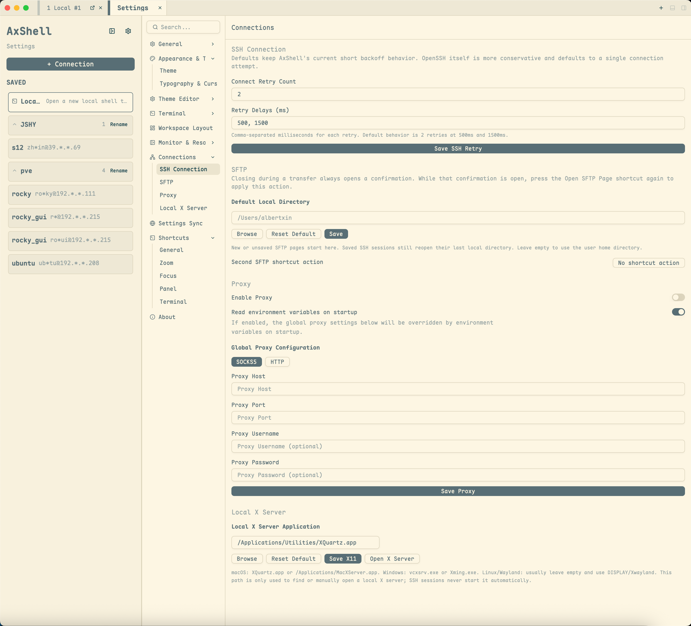

[English](terminal-ssh.md) · [文档导航](../README.zh.md)

# 终端与 SSH

## 本地终端

从已保存会话区域顶部固定的**本地终端**入口打开本地 Shell。本地终端与 SSH 终端共用标签、Pane、搜索和外观设置。

在**设置 > 终端 > 本地 Shell 配置**中选择默认 Shell。配置由程序和零个或多个参数组成，每行写一个参数。可用于 `zsh`、`bash`、PowerShell、命令提示符、Git Bash 和 WSL。要指定 WSL 发行版，程序填写 `wsl.exe`，参数分两行填写 `-d` 和发行版名称。

配置可在自定义前复制。新建本地终端使用当前默认配置；已有本地标签在分屏或重连时保持其原配置。

## 新建 SSH 会话

1. 打开 **新建连接** 或会话选择器，并选择 **SSH**。
2. 在**连接**分区输入主机、端口和用户名。
3. 在**认证**分区选择密码或私钥认证。
4. 按需在**组织**分区设置连接名称或分组。
5. 展开**高级 SSH 选项**，可设置代理、SFTP 路径、X11 转发、旧算法兼容性和连接快捷键。
6. 使用 **保存** 或 **保存并连接**。

私钥认证支持密钥文件路径或内联密钥内容，并可填写私钥口令。

非 SSH 终端会话见[串口与 Telnet](serial-telnet.zh.md)。

## 主机密钥验证

首次连接某个主机和端口时，AxShell 会显示服务器主机密钥算法和 SHA-256 指纹。请先通过独立渠道与服务器管理员核对指纹，再确认信任。接受后的密钥只保存在本机配置中，不会进入会话同步。

后续连接会自动接受已保存的密钥。如果服务器提供不同的密钥，连接会保持阻断，直到核对新指纹并明确替换旧密钥。拒绝、关闭确认窗口或两分钟内未响应都会使连接失败。

## 已保存会话

- 会话可以分组；没有分组的会话显示在**未分组**中。
- 分组可以展开、收起和重命名。
- 重命名分组会更新该组内已保存会话的分组信息。
- **本地终端**固定在 SSH 分组上方，不会保存为 SSH 会话。
- 已保存会话会记录最近使用时间。
- 每个已保存会话可以在编辑表单中录制**连接快捷键**；在终端或 SFTP 工作区按下后会打开并聚焦该 SSH 会话。
- 连接快捷键必须带修饰键或使用 `F1`-`F24`，不能与其他连接或应用快捷键冲突，且不会包含在无凭据会话导出文件中。
- 鼠标悬停在已保存会话上会展示连接快捷键和已配置的 SFTP 路径。
- 右键的**复制会话 JSON**会写入与导出相同的无凭据 JSON。在 SSH 表单中用**从剪贴板导入**可加载一条复制的会话；编辑已有会话时，本机凭据和快捷键不会被覆盖。
- 导出分组使用与完整导出相同的分享格式，因此导入后会恢复该分组的全部会话及其分组名。

## 连接行为

- SSH 会话可以使用单会话代理，也可以使用全局或环境变量代理。
- 工作区会显示连接进度和重试状态。
- 关闭标签或 Pane 时会关闭该终端拥有的 backend。
- 旧版 SSH 算法默认关闭。仅当您信任的服务器无法协商当前算法时，才在单个会话中开启兼容性选项。启用后 AxShell 直接使用该旧算法集，绝不会在普通连接失败后自动降级到弱算法。

代理传输和图形转发设置见[代理与 X11](proxy-x11.zh.md)。
